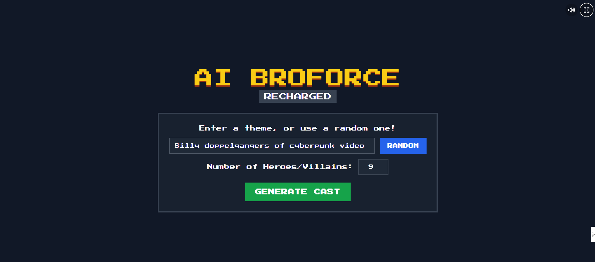

# Project TODO List
Be sure to always update the todo.md tasks.ms gemini_code_log.md
This file tracks planned features and improvements for the "AI Broforce: Recharged" project.

## Bugs
- [x] Fix game freeze and annoying sound loop on startup.
- [ ] Missing menu

## High Priority
- [x] fix floating menu, no menu aivalable or settings
- [ ] Implement advanced movement: `Grappling Hook`, `Flight`, and `Glide`.
- [ ] Implement core movement abilities: `Double Jump`, `Air Dash`, `Wall Slide`, `Dig`, 
- [ ] Add distinct sound effects for core movement abilities and explotions and shooting
- [ ] Add more visual feedback for active special abilities (e.g., a glow for flight, wind lines for glide).

## Medium Priority
- [ ] Create new enemy types with different behaviors (e.g., flying enemies, charging melee enemies).
- [ ] Design and add 2-3 new levels with unique platforming challenges.
- [ ] Add a "High Scores" screen that persists between sessions.
- [ ] Improve boss AI with multiple attack patterns.
- [ ] update the pictures of the heroes for the backround to include players stats and config like an arsinal in the backrund and also have a more2d thumnnail version next to character profile card

## Low Priority
- [ ] Add environmental hazards (e.g., spike pits, laser grids).
- [ ] Create a more detailed "How to Play" section on the main menu.
- [ ] Add controller support for gameplay.

   - [ ] Explore procedural level generation for endless replayability.
   - [ ] Add more "Bro" characters with unique abilities.
   - [ ] Add a "Story Mode" with a narrative arc.
   - [ ] Add a "Daily Challenge" mode with unique modifiers.
   - [ ] Add a "Versus" mode for competitive play.
   - [ ] Add a "Tournament" mode for competitive play.
   - [ ] Add a "Spectator" mode for watching other players.
   - [ ] Add a "Replay" system for watching past games.
##
   [ ] Add online co-op multiplayer.